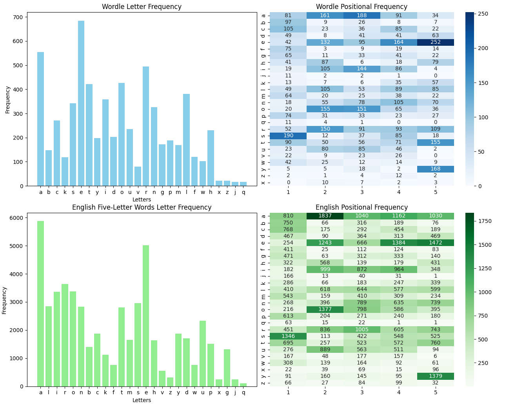

# Word Analysis and Visualization

This project analyzes and visualizes letter and positional frequencies of five-letter words from two datasets:

1. **Wordle Past Answers**: Scraped from TechRadar's Wordle archive.
2. **English Five-Letter Words**: Sourced from the NLTK corpus.

The project includes data fetching, processing, statistical analysis, and visualization.


---

## Features

- **Data Fetching**:
  - Scrapes Wordle answers from a live webpage.
  - Fetches five-letter words from the NLTK corpus, saving them locally for efficiency.
- **Data Processing**:
  - Calculates letter frequencies and positional frequencies.
  - Computes statistical measures (mean, standard deviation, normalized frequencies).
- **Visualization**:
  - Bar charts and heatmaps for letter and positional frequencies.
  - All visualizations are displayed in continuous figures using Matplotlib.
- **Efficiency**:
  - Reuses previously saved data to avoid redundant processing or downloading.

---

## Requirements

### Python Version

- Python 3.8 or higher

### Dependencies

Install the required libraries with:

```bash
pip install -r requirements.txt
```

Alternatively, you can install the libraries individually:

```bash
pip install nltk requests beautifulsoup4 numpy pandas matplotlib seaborn
```

---

## How It Works

### 1. Fetching Data

- **Wordle Answers**:
  - Scraped from TechRadar’s [Wordle Archive](https://www.techradar.com/news/past-wordle-answers).
  - Saves the answers to `wordle.txt`.
- **Five-Letter Words**:
  - Retrieved from NLTK's `words` corpus.
  - Saves the data to `five_letter_words.txt` for reuse in subsequent runs.

### 2. Processing

- Cleans and filters the data into lists of five-letter words.
- Computes:
  - Overall letter frequencies.
  - Positional frequencies (frequency of letters at each position in words).

### 3. Visualization

- Generates:
  - **Bar Charts**: Letter frequency distribution.
  - **Heatmaps**: Positional letter frequencies.
- Displays all plots in a single Matplotlib figure.

---

## How to Run the Project

1. **Run the Script**:

   ```bash
   python main.py
   ```

2. **View Results**:
   - Check console output for frequency statistics.
   - Visualizations will appear in a Matplotlib window.

---

## File Structure

```plaintext
.
├── main.py               # Main script to run the project
├── README.md             # Project documentation
├── requirements.txt      # Python dependencies
├── five_letter_words.txt # Saved five-letter words (generated on first run)
├── wordle.txt            # Saved Wordle answers (generated on each run)
```

---

## Customization

You can modify the following:

- **`wordle_url`**: Update the URL in `main()` if the Wordle archive changes.
- **`five_letter_words.txt`**: Replace with a custom word list.
- **Visualization Styles**:
  - Adjust colors, sizes, or labels in the plotting functions.
